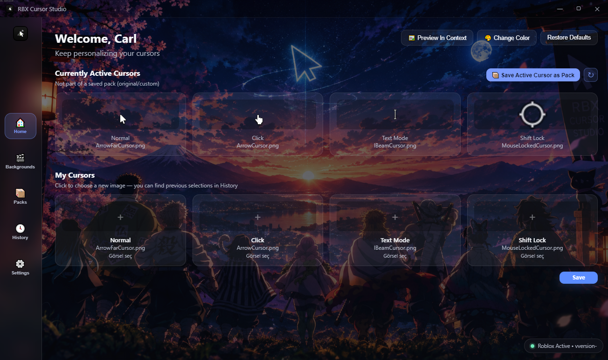

<p align="center">
  <a href="README.md">🇬🇧 English</a> •
  <a href="README.tr.md">🇹🇷 Türkçe</a>
</p>

## ⚠️ Disclaimer

RBX Cursor Studio is an independent, community-made tool and is **not affiliated with, endorsed by, or associated with Roblox Corporation** in any way. "Roblox" is a trademark of Roblox Corporation. This tool only modifies local cursor files on your own device and does not interact with, modify, or inject into the Roblox game client itself.

# 🎨 RBX Cursor Studio

A lightweight Windows tool for customizing Roblox cursors.


*Shown with a custom background — backgrounds are fully customizable*

## ✨ Features

### 🖱️ Cursor Customization
- Customize every Roblox cursor type individually (arrow, far arrow, I-beam, mouse-locked, etc.)
- Apply your selection to Roblox instantly, with one click
- Cursors are automatically fitted and centered in a 64×64 canvas
- Smoothing is disabled to keep pixel edges crisp

### 🎯 Built-in Cursor Editor
- **Auto-Fit + Center** — snaps any imported image to the ideal size in one click
- **Center Only** and **Reset Size** shortcuts
- Manual zoom slider (0.4x – 3x) for fine control
- Drag-and-drop repositioning directly on the canvas
- **Colorize** — turn a black-and-white cursor into a colored one with a hue slider
- **Generate Color Variations** — create multiple color options from the same cursor in one click

### 📦 Cursor Packs
- Create, save, and manage as many cursor packs as you like
- Export packs as `.rbxcursor` / `.zip` files to share with friends
- Import a pack someone sent you with drag-and-drop
- **Quick Pack Switching** — jump between saved packs instantly with `Ctrl+Alt+1` / `Ctrl+Alt+2` / `Ctrl+Alt+3`, even while Roblox is running

### 🕓 History
- Browse every cursor you've previously selected in a dedicated History tab and reapply it anytime

### 🖼️ In-Context Preview
- Test your cursors at true size on a mock Roblox screen (HUD, health/coin counters, PLAY button, chat box, and a Shift Lock toggle included)
- Simulate Shift Lock mode to preview how the cursor behaves in that state

### 🔄 Automatic Update Handling
- Automatically detects the newest Roblox client directory
- With Auto-Reinstall enabled, your saved cursors are **automatically reapplied every time Roblox updates**
- Back up your original Roblox cursors and restore them with one click
- A small, draggable live status badge shows whether Roblox is currently running

### 🎬 Personalization
- Swap the app's own background for your own image, or reset to default
- Clean, modern dark-themed interface throughout

### ⚙️ Settings
- **English & Turkish** interface with instant language switching
- Option to **launch automatically on Windows startup**
- View the currently detected Roblox version from the Settings screen

### 💻 Platform & Distribution
- Available as both a **portable executable** and an **NSIS installer**
- Built on Electron — lightweight, with zero background bloat
- Ready-made `.bat` scripts for building from source (`install.bat` / `start.bat` / `exe_maker.bat`)
- 100% open-source, with releases scanned on VirusTotal
- Never touches the Roblox game client itself — only modifies local cursor files

## 📥 Download

### Setup
Download the installer to install RBX Cursor Studio on your PC.

### Portable
Use the portable version without installing the application.

> Download the latest version from the [Releases](../../releases) page.

## 🔧 Building from Source

### Portable
Download and extract the ZIP, then run `RBX Cursor Studio.exe` inside the extracted folder — no installation needed.

**Windows users: the ready-made scripts are enough — no terminal needed.**
The steps below are for manual setup or non-Windows systems.

> 🇬🇧 English users: `install.bat` / `start.bat` / `exe_maker.bat`

Requirements: Node.js 18+ and npm

```bash
git clone https://github.com/Carl00-mpeek/Roblox-Cursor-Studio.git
cd Roblox-Cursor-Studio
npm install
npm start        # run in development
npm run dist     # build the installer and portable exe
```

## 🛡️ VirusTotal

The latest release has been scanned with VirusTotal.

- [🔍 View VirusTotal scan results](https://www.virustotal.com/gui/file/74cc0a0cbff63511f8d515d466e54625f4dae41db090b397941b14ca10d95119?nocache=1)
- [🔍 View VirusTotal scan results for Setup](https://www.virustotal.com/gui/file/ec33797c40e25e2f620e631eb58119b4f1f0d69c2e52c1c891b7fc7f2cab5fbf?nocache=1)
- [🔍 View VirusTotal scan results for Portable]()


## ☕ Support the Project

If you enjoy RBX Cursor Studio, you can support the project with a small donation.

[☕ Support the Project](https://buymeacoffee.com/rbxcursor)

## 📄 License

This project is licensed under the [PolyForm Noncommercial License 1.0.0](LICENSE).
Required Notice: Copyright (c) 2026 Demhat Dayan

Free for personal, educational, and noncommercial use. **Commercial use, resale, or
redistribution for profit is not permitted** without written permission.
