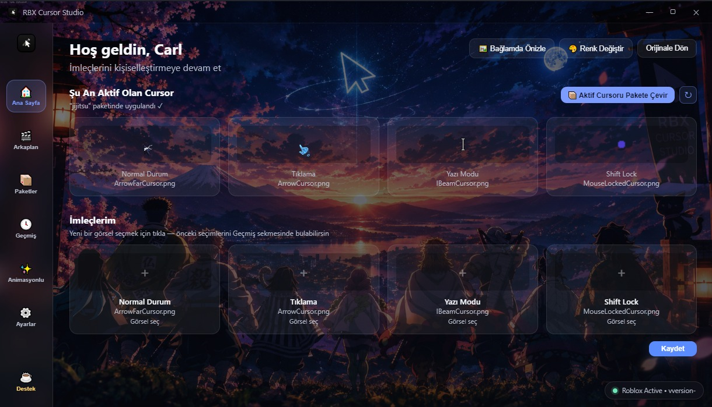

<p align="center">
  <a href="README.md">🇬🇧 English</a> •
  <a href="README.tr.md">🇹🇷 Türkçe</a>
</p>

## ⚠️ Uyarı

RBX Cursor Studio bağımsız, topluluk tarafından geliştirilmiş bir araçtır ve **Roblox Corporation ile hiçbir bağlantısı, ortaklığı veya onayı yoktur**. "Roblox", Roblox Corporation'a ait bir ticari markadır. Bu araç Roblox'un belleğini okumaz, ona kanca (hook) takmaz ve oyun istemcisinin kodlarına ya da çalıştırılabilir dosyalarına müdahale etmez. Yerel Roblox klasörünüzdeki imleç görsellerini değiştirir ve Animasyonlu İmleç özelliğini kullanırsanız, standart Windows API'leriyle masaüstünüzde ayrı bir overlay penceresi çizer. Roblox oyun dosyalarının değiştirilmesini resmen desteklemez, bu yüzden **kullanım riski size aittir**.

# 🎨 RBX Cursor Studio

Roblox imleçlerini özelleştirmek için hafif bir Windows aracı.

**Güncel sürüm: 3.3.5**


*Örnek özel arkaplan ile gösterilmiştir — arkaplan kişiselleştirilebilir*

## 🆕 3.3.5 ile Gelenler

- ✨ **Animasyonlu İmleçler (.ANI) — Beta** — Normal, Tıklama, Yazı ve Shift Lock durumlarına animasyonlu imleç ata; native bir Windows overlay'i ile akıcı ve piksel bazlı şeffaflıkla çizilir
- ⌨️ **Animasyonu Aç/Kapat Kısayolu** — `Ctrl+Alt+0` (değiştirilebilir) ile animasyonlu imleci anında gizle ya da geri getir; Roblox odaktayken bile çalışır
- ☕ **Destek butonu** — sol menünün altındaki yeni buton, projenin bağış sayfasını açar

## ✨ Özellikler

### 🖱️ İmleç Özelleştirme
- Roblox'un tüm imleç türlerini (ok, uzak ok, I-beam, kilitli fare vb.) tek tek özelleştir
- Seçtiğin görseli tek tıkla anında Roblox'a uygula
- İmleçler 64×64 alana otomatik olarak dengeli biçimde sığdırılır ve ortalanır
- Piksel netliğini korumak için yumuşatma (anti-aliasing) kapalı tutulur

### ✨ Animasyonlu İmleçler (.ANI) — 🧪 Beta
> 🧪 **Bu özellik beta aşamasındadır.** Testlerimizde iyi çalışıyor, ancak otomatik durum tespiti (Tıklama / Yazı / Shift Lock) sezgisel yöntemlere dayanır ve bazı oyunlarda ya da kurulumlarda durumu ara sıra yanlış algılayabilir. Bir sorunla karşılaşırsan lütfen [bir issue aç](../../issues) — geri bildirimlerin geliştirmeyi hızlandırır.

- Her durum için bir `.ani` dosyası seç: **Normal (ok), Tıklama (hover), Yazı ve Shift Lock**
- Küçük bir native yardımcı tarafından, tıklamayı geçiren ve her zaman üstte duran bir overlay olarak, gerçek piksel bazlı alfa ile çizilir — siyah kutu ya da kenar artefaktı yok
- Durum başına **boyut, hız ve FPS** ayarı (240 FPS'e kadar), **otomatik ortalama** veya elle hotspot
- Daha akıcı ya da daha hafif fare takibi için ayarlanabilir **takip aralığı**
- **Otomatik durum tespiti** — animasyon Normal, Tıklama, Yazı ve Shift Lock arasında kendiliğinden geçer; canlı bir rozet hangi durumun aktif olduğunu gösterir
- Roblox açık olmasa bile herhangi bir animasyonu masaüstünde 6 saniye boyunca **önizle**
- İstediğin zaman animasyonu kaldır, orijinal statik imleç geri gelir
- **Animasyonu aç/kapat kısayolu** — varsayılan `Ctrl+Alt+0`; Animasyonlu sekmesinden istediğin kombinasyonu ya da tek başına `F1`–`F24` tuşunu atayabilirsin. Uygulama her açıldığında animasyon açık başlar
- Yalnızca animasyon atanan durumlar etkilenir; diğer durumlar normal statik imleçle çalışmaya devam eder

> **Not:** Bir duruma animasyon atandığında Roblox'un o duruma ait statik imleci görünmez bir görselle değiştirilir; bu yüzden animasyon kapalıyken o durumda hiç imleç görünmez. Animasyon atadıktan sonra Roblox'u yeniden başlat, böylece güncellenmiş imleç görsellerini yükler.

### 🎯 Gelişmiş İmleç Düzenleyici
- **Otomatik Boyutlandır + Ortala** — yüklenen görseli tek tıkla ideal boyuta getirir
- **Sadece Ortala** ve **Boyutu Sıfırla** kısayolları
- Kaydırma çubuğuyla manuel yakınlaştırma/uzaklaştırma (0.4x – 3x)
- Canvas üzerinde sürükle-bırak ile serbest konumlandırma
- **Renklendir** — siyah-beyaz bir imleci ton (hue) kaydırıcısıyla renkli hale getir
- **Renk Varyasyonları Oluştur** — tek tıkla aynı imlecin birden fazla renk seçeneğini üret

### 📦 Paket Sistemi
- İstediğin kadar imleç paketi oluştur, kaydet ve yönet
- Paketleri `.rbxcursor` / `.zip` olarak dışa aktar ve arkadaşlarınla paylaş
- Bir arkadaşının gönderdiği paket dosyasını sürükle-bırak ile içe aktar
- **Hızlı Paket Geçişi** — `Ctrl+Alt+1` / `Ctrl+Alt+2` / `Ctrl+Alt+3` kısayollarıyla, Roblox içindeyken bile kayıtlı paketler arasında anında geçiş yap

### 🕓 Geçmiş
- Daha önce seçtiğin tüm imleçleri ayrı bir Geçmiş sekmesinde görüntüle ve istediğin zaman tekrar uygula

### 🖼️ Bağlamda Önizleme
- Sahte bir Roblox ekranı (HUD, can/coin göstergesi, OYNA butonu, sohbet kutusu ve Shift Lock butonu dahil) üzerinde, gerçek boyutlarında imleç dene
- Shift Lock modunu simüle ederek imlecin o moddaki görünümünü test et

### 🔄 Otomatik Güncelleme Desteği
- En yeni Roblox istemci klasörünü otomatik olarak algılar
- Otomatik Düzeltme açıldığında, Roblox her güncellendiğinde kayıtlı imleçlerin **otomatik olarak yeniden kurulmasını** sağlar
- Orijinal Roblox imleçlerini yedekle ve tek tıkla geri yükle
- Roblox'un o an çalışıp çalışmadığını gösteren küçük, sürüklenebilir canlı durum rozeti

### 🌈 Toplu Renk Değiştirici
- **Renk Değiştir** — şu an Roblox'ta aktif olan tüm imleçleri (Normal, Tıklama, Yazı Modu, Shift Lock) tek bir renk tonuyla aynı anda boya
- Boyut ve konuma dokunmadan, yalnızca rengi değiştirir — tekrar ortalama/boyutlandırma gerekmez
- Canlı önizlemeli ton kaydırıcısı ve hızlı seçim için hazır renk şeridi
- Uygula dediğinde tüm imleçler anında Roblox'a kaydedilir ve uygulanır

### 🎬 Kişiselleştirme
- Uygulamanın arkaplanını kendi görselinle değiştir, istediğinde varsayılana dön
- Uygulama genelinde sade ve modern, koyu temalı bir arayüz

### ⚙️ Ayarlar
- **Türkçe / İngilizce** arayüz, anlık dil değişimi
- **Windows başlangıcında otomatik açılma** seçeneği
- O an algılanan Roblox sürümünü Ayarlar ekranından görüntüleme
- Sol menünün altındaki **☕ Destek butonu** bağış sayfasını açar

### 💻 Platform ve Dağıtım
- Hem taşınabilir (portable) exe hem de NSIS kurulum dosyası olarak dağıtılır
- Electron tabanlı ve hafif; animasyonlu imleçler, yalnızca bir animasyon atandığında başlayan küçük bir native yardımcıda (`cursor_helper.exe`) çalışır
- Kaynak koddan derlemek isteyenler için hazır `.bat` script'leri (`kur.bat` / `baslat.bat` / `exe_yap.bat`)
- %100 açık kaynak, sürümler VirusTotal ile taranmıştır
- Roblox'un belleğini okumaz, kodlarına ya da çalıştırılabilir dosyalarına dokunmaz — Roblox klasöründeki imleç görsellerini değiştirir ve animasyonlu imleçler için ayrı bir overlay penceresi çizer

## 📥 İndir

### Kurulum
RBX Cursor Studio'yu bilgisayarına kurmak için yükleyiciyi indir.

### Taşınabilir (Portable)
Uygulamayı kurmadan taşınabilir sürümü kullan.

> En güncel sürümü [Releases](../../releases) sayfasından indirebilirsin.

### ❓ Animasyonlu imleç görünmüyor, neden?

- Roblox **exclusive tam ekran** modundaysa Windows üstüne hiçbir overlay çizmeye izin vermez (Discord, Steam gibi overlay'ler için de aynıdır). Roblox'u pencereli ya da borderless tam ekrana al.
- İlk animasyonu atadıktan sonra Roblox'u yeniden başlat.
- Animasyonlu sekmesindeki **Önizle** butonunu dene: animasyonu masaüstünde 6 saniye gösterir, böylece çizimin kendisinin çalışıp çalışmadığını anlarsın.
- Animasyonun kısayolla (varsayılan `Ctrl+Alt+0`) kapatılmadığından emin ol.

## 🔧 Kaynak Koddan Derleme

### Taşınabilir
ZIP dosyasını indir ve çıkart, ardından çıkarttığın klasördeki `RBX Cursor Studio.exe` dosyasını çalıştır — kuruluma gerek yok.

**Windows kullanıcıları için: hazır script'ler yeterli — terminale gerek yok.**
Aşağıdaki adımlar manuel kurulum veya Windows dışı sistemler içindir.

> 🇹🇷 Türkçe kullanıcılar için: `kur.bat` / `baslat.bat` / `exe_yap.bat`

Gereksinimler: Node.js 18+ ve npm. Animasyonlu imleçler için native yardımcıyı derlemek üzere ayrıca bir C++ derleyicisi (MinGW `g++` ya da MSVC `cl.exe`) gerekir.

> ⚠️ **Dikkat: yaklaşık 260 MB indirme.** Bilgisayarında C++ derleyicisi yoksa `kur.bat` bunu (MinGW-w64 / WinLibs) `winget` ile otomatik indirip kurar — yaklaşık **260 MB**, yalnızca bir kez; internet hızına göre ilk kurulum birkaç dakika sürebilir. Zaten `g++` ya da MSVC kuruluysa ek bir şey indirilmez. Derleyici olmasa da uygulama çalışır, yalnızca animasyonlu imleçler devre dışı kalır.
>
> Bu yalnızca kaynak koddan derleme için geçerlidir. **Kurulum (Setup)** ve **Taşınabilir (Portable)** sürümler animasyonlu imleç yardımcısını zaten içerir, derleyici gerektirmez.

```bash
git clone https://github.com/Carl00-mpeek/Roblox-Cursor-Studio.git
cd Roblox-Cursor-Studio
npm install
npm start        # geliştirme modunda çalıştır
npm run dist     # yükleyici ve taşınabilir exe oluştur
```

## 🛡️ VirusTotal

En son sürüm VirusTotal ile taranmıştır.

- [🔍 VirusTotal tarama sonuçlarını görüntüle](https://www.virustotal.com/gui/file/d6164ae95c241574d51e8ae521035cb12dbc00a99e30169d805f5ea60930262f?nocache=1)
- [🔍 Setup için VirusTotal tarama sonuçlarını görüntüle](https://www.virustotal.com/gui/file/944e5b08bcebb04b95a1f71bae804b0a4976773f082f9bec78af6075c105f3c6?nocache=1)
- [🔍 Portable için VirusTotal tarama sonuçlarını görüntüle](https://www.virustotal.com/gui/file/14650d000c917acadd5312ddfeb358fa3ef27be11eaadc003150955f4e513971?nocache=1)
  
## ☕ Projeyi Destekle

RBX Cursor Studio ücretsiz — ve onu ayakta tutan şey senin desteğin. Roblox'unu biraz daha eğlenceli hale getirdiyse, küçük bir bağış şunlara yardımcı olur:

- ⚡ Roblox bir şeyi değiştirdiğinde daha hızlı güncelleme yayınlamamıza
- 🛠️ Hataları daha çabuk düzeltmemize
- ✨ Yeni özellikler geliştirmemize (animasyonlu imleçler gibi!)

Her kahve gerçekten fark yaratıyor — teşekkürler! 💛

[☕ Bana bir kahve ısmarla](https://buymeacoffee.com/rbxcursor)

## 📄 Lisans

Bu proje [PolyForm Noncommercial License 1.0.0](LICENSE) ile lisanslanmıştır.
Gerekli Bildirim: Telif Hakkı (c) 2026 Demhat Dayan

Kişisel, eğitim amaçlı ve ticari olmayan kullanım için ücretsizdir. **Ticari kullanım, yeniden satış veya
kâr amaçlı dağıtım**, yazılı izin olmadan yapılamaz.
